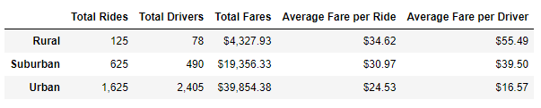
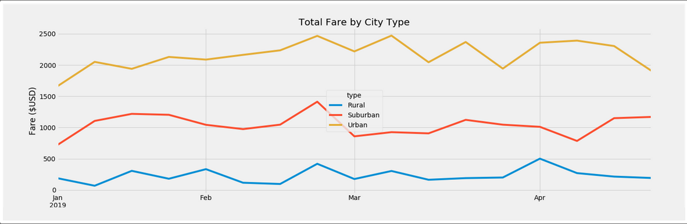

# PyBer_Analysis

### Overview of the analysis

Purpose of this analysis is to compare the total weekly fares gained between different city types using PyBer, a ride-sharing service. We will be creating Dataframes and visualizations to show this comparison. This analysis will present the CEO with recommendations to address any disparities among the city types.

### Results

Based on the results shown in the image below, Urban cities, due to their larger and more condensed population, have a much higher number of rides requested which also explains the large number of drivers available in them and overall total fares gained. They also have a smaller average fare per ride due to the short distances traveled. Many businesses also set up their offices within Urban locations due to their condensity and short distances from other businesses resulting in larger ride requests for individuals. Urban cities also tend to hold more events throughout their city.

Rural cities tend to have a larger average fare per ride due to longer distances travelled which also explains the average fare per driver being much higher than Suburban and Urban cities. Rural cities tend to be built more further apart requiring longer distances traveled.

### Summary

Based on the image below, several recommendations for the CEO in order to balance the number of rides and drives between the different type of cities is:

- To create bonus incentives rewards (Surges) for drivers during certain months of the year to shift their focus to suburban and Rural cities. There currently is more drivers in Urban city types than there are rides requested.
- Offer drivers possible discounts on gas prices and maintenance packages on their vehicles for moving to Suburban and Rural areas.
- This analysis is only based on the first quarter of the year, further information is required to make better judgement on the overall health of the business and whether or not this trend continues during other times of the year or not.
- 

